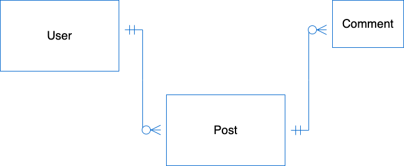

# SEIR Project 3 Spotlight app - API

This is the backend app, designed to work with the client app.
Repo to the client app is here:
https://github.com/shaialoni/project-3-react

## About Spotlight
A social media app that allow users to "SPOTLIGHT" a major current event, a special moment of their day, or just an image that provided a fleeting moment of joy and share it with others.

## Technology
We will be using a Node server, with Moongose and Express for our back end app, that will support full CRUD actions. 
The app will utilize AWS to store the uploaded images and MongoDB Atlas as the cloud database.
Dependencies are all managed by NPM with emphasys on AWS-SDK package and Multer package to handle the upload to AWS.
Links to all technologies will be provided at the end of this document.

### Installation instructions
To use this app you will need to install all dependencies needed, and you can do that by running these commands in your command line:

```
$ npm install
```
```
$npm start
```

This app will require an AWS account and an AWS bucket to be set up (see link to AWS below).
You will also need to set up an envoroment file (.env) with the following items:
 - AWS key ID
 - AWS secret key ID
 - AWS bucket name

AWS_ACCESS_KEY_ID=" "
AWS_SECRET_ACCESS_KEY=" "
BUCKET=" "

### User Story
- As an unregistered user, I would like to view all images
- As an unregistered user, I would like to sign up with email and password.
- As a registered user, I would like to sign in with email and password.
- As a signed in user, I would like to change password.
- As a signed in user, I would like to sign out.
- As a signed in user, I would like to upload an image to AWS with a name
- As a signed in user, I would like to update the name of my image on AWS.
- As a signed in user, I would like to see all my images on AWS.
- As a signed in user, I would like to see the thumbnail of all images on AWS.
- As a signed in user, I would like to comment on posts
- As a signed in user, I would like to delete my comments
- As a signed in user, I would like to 'like' images
- As a signed in user, I would like to delete the reference of my image from the database.
- As a signed in user, I would like to see the following data for any post:
    - date created/uploaded
    - date modified
    - owner (user who created the post)
    - name

### Stretch Goals
- As an unregistered user, I would like to download any image
- As a signed in user, I would like to 'like' images
- As a signed in user, i would like to follow another user
- As a signed in user, i would like to share another user's post
&nbsp;
&nbsp;
## Route Table
 - ### User Authentication
    | Verb   | URI Pattern         | Controller#Action |
    | ------ | ------------------- | ----------------- |
    | POST   | `/sign-up`          | `users#signup`    |
    | POST   | `/sign-in`          | `users#signin`    |
    | PATCH  | `/change-password/` | `users#changepw`  |
    | DELETE | `/sign-out/`        | `users#signout `  |
 - ### Posts 
    | Verb   | URI Pattern | Controller#Action    |
    | ------ | ----------- | -------------------- |
    | GET    | `/posts` | `other users' feed` |
    | GET    | `/myPosts`  | `my feed` |
    | POST   | `/posts` | `add` |
    | PATCH  | `/posts/:postId`  | `update`|
    | DELETE | `/posts/:postId`  | `destroy`|
 - ### Comments 
    | Verb   | URI Pattern           | Controller#Action |
    | ------ | --------------------- | ----------------- |
    | POST   | `/:postId/:commentId` | `add`             |
    | DELETE | `/:postId/:commentId` | `destroy`         |  
- ### Likes 
    | Verb   | URI Pattern           | Controller#Action |
    | ------ | --------------------- | ----------------- |
    | POST   | `/likes/:postId` | `add like`             |
    | DELETE | `/likes/:postId` | `remove like`         |  
    
&nbsp;
&nbsp;     
### ERD

&nbsp;
&nbsp;
## Schema
 - ### User
    - email: string
        - required
        - unique
    - username: string
        - required
        - unique
    - hashedPassword: string
        - required
    - token: string
    - timestamps
    
 - ### Post
    - title: string
    - caption: string
    - image: url (aws)
    - likes: (list of user ids)
    - follow: boolean (reach goal)
    - timestamp:
    - owner: mongoose.Schema.Types.ObjectId
        - required

 - ### Comment (sub-schema)
    - comment: string
&nbsp;

## Development Roles 
- Team Manager: Dang Do
- Front-End SME: Trevor Zou
- Back-End SME: Shai Aloni 

### Technology Links:

###### AWS - https://aws.amazon.com/
###### Mongoose JS - https://mongoosejs.com/
###### MongoDB - https://www.mongodb.com/
###### NPM JS - https://www.npmjs.com/
